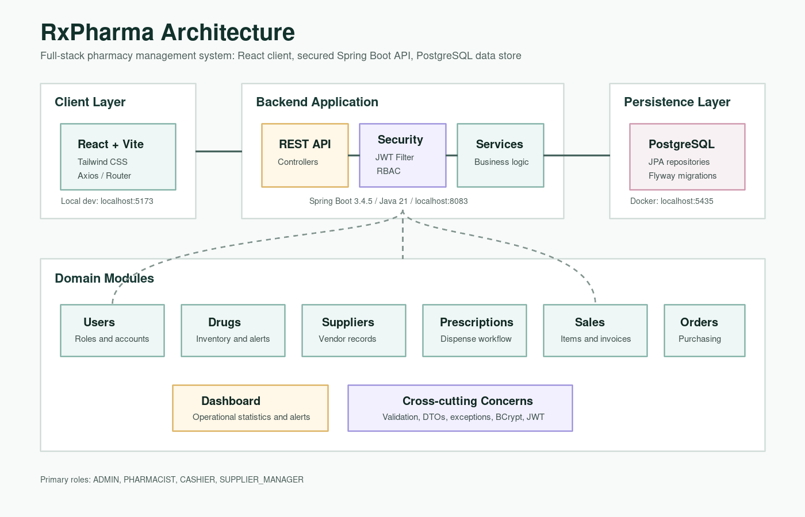

# RxPharma

RxPharma is a full-stack pharmacy management system for managing medicines, suppliers, prescriptions, sales, purchase orders, users, authentication, and operational dashboard statistics.

The project is organized as a Spring Boot REST API backed by PostgreSQL and Flyway migrations, with a React/Vite frontend prepared as the client application layer.

## Architecture



RxPharma follows a layered client-server architecture:

- **Frontend:** React + Vite application intended for pharmacy staff workflows.
- **API Layer:** Spring Boot REST controllers expose secured endpoints under `/api/**`.
- **Security Layer:** Spring Security validates JWT tokens and enforces role-based access control.
- **Service Layer:** Business logic for inventory, prescriptions, sales, suppliers, purchase orders, users, and dashboard summaries.
- **Persistence Layer:** Spring Data JPA repositories map domain entities to PostgreSQL tables.
- **Database Layer:** PostgreSQL stores application data, while Flyway manages versioned schema migrations and seed data.

## Features

- JWT-based authentication and stateless API sessions.
- Role-based authorization for `ADMIN`, `PHARMACIST`, `CASHIER`, and `SUPPLIER_MANAGER`.
- User management, role updates, password changes, and password reset token support.
- Drug inventory management with stock adjustment, low-stock alerts, expiry alerts, and expired-drug checks.
- Supplier management with active and on-hold supplier statuses.
- Prescription creation, prescription-drug assignment, dispensing, cancellation, and search.
- Sales recording with sale items and invoice retrieval.
- Purchase order creation, status tracking, delivery handling, and cancellation.
- Dashboard statistics for key pharmacy operations.
- PostgreSQL schema management through Flyway migrations.

## Tech Stack

| Layer | Technology |
| --- | --- |
| Frontend | React, Vite, Tailwind CSS, Axios, React Router |
| Backend | Java 21, Spring Boot 3.4.5, Spring Web, Spring Security |
| Persistence | Spring Data JPA, Hibernate |
| Database | PostgreSQL 15 |
| Migrations | Flyway |
| Authentication | JWT, BCrypt password hashing |
| Tooling | Maven Wrapper, Docker Compose, ESLint |

## Repository Structure

```text
rxpharma/
|-- README.md
|-- rxpharma_Architecture.png
|-- docs/
|   `-- architecture.svg
|-- rxpharma-backend/
|   |-- docker-compose.yml
|   |-- pom.xml
|   `-- src/
|       |-- main/java/com/rxpharma/
|       |   |-- controller/
|       |   |-- dto/
|       |   |-- entity/
|       |   |-- exception/
|       |   |-- repository/
|       |   |-- security/
|       |   `-- service/
|       `-- main/resources/
|           |-- application.properties
|           `-- db/migration/
`-- rxpharma-frontend/
    |-- package.json
    `-- src/
```

## Backend API Modules

| Module | Base Path | Purpose |
| --- | --- | --- |
| Authentication | `/api/auth` | Login, registration, logout, forgot password, reset password |
| Users | `/api/users` | User administration and role management |
| Drugs | `/api/drugs` | Inventory CRUD, stock adjustment, stock and expiry alerts |
| Suppliers | `/api/suppliers` | Supplier CRUD and status management |
| Prescriptions | `/api/prescriptions` | Prescription workflow and dispensing |
| Sales | `/api/sales` | Sales, sale items, search, and invoice retrieval |
| Purchase Orders | `/api/purchase-orders` | Ordering, status updates, delivery, and cancellation |
| Dashboard | `/api/dashboard/stats` | Summary metrics for the application dashboard |

## Prerequisites

- Java 21
- Node.js and npm
- Docker and Docker Compose
- Git

## Getting Started

### 1. Clone the Repository

```bash
git clone <repository-url>
cd rxpharma
```

### 2. Start PostgreSQL

```bash
cd rxpharma-backend
docker compose up -d
```

The database container exposes PostgreSQL on port `5435`.

Default local database settings:

```properties
spring.datasource.url=jdbc:postgresql://localhost:5435/rxpharma_db
spring.datasource.username=rxpharma_user
spring.datasource.password=rxpharma_pass
```

### 3. Run the Backend

```bash
cd rxpharma-backend
./mvnw spring-boot:run
```

The backend runs on:

```text
http://localhost:8083
```

Flyway runs automatically on startup and applies migrations from:

```text
rxpharma-backend/src/main/resources/db/migration
```

### 4. Run the Frontend

Open a second terminal:

```bash
cd rxpharma-frontend
npm install
npm run dev
```

The frontend development server typically runs on:

```text
http://localhost:5173
```

The backend CORS configuration allows requests from `http://localhost:5173` and `http://localhost:3000`.

## Common Commands

### Backend

```bash
cd rxpharma-backend
./mvnw test
./mvnw spring-boot:run
docker compose up -d
docker compose down
```

### Frontend

```bash
cd rxpharma-frontend
npm install
npm run dev
npm run build
npm run lint
npm run preview
```

## Configuration Notes

- The backend uses stateless JWT authentication.
- Public routes are limited to `/api/auth/**`; all other API routes require authentication.
- Passwords are hashed with BCrypt.
- `spring.jpa.hibernate.ddl-auto=validate` is used, so schema changes should be made through Flyway migrations.
- The JWT secret in `application.properties` is a development placeholder and should be replaced before production deployment.

## Database Overview

Flyway migrations create the core database model:

- `users`
- `suppliers`
- `drugs`
- `prescriptions`
- `prescription_drugs`
- `sales`
- `sale_items`
- `purchase_orders`
- `password_reset_tokens`

Sample supplier and drug records are inserted by the seed migration.

## Team Members

- Biruk Mulatu
- Yesehak Abraham
- Habtamu Zeleke
